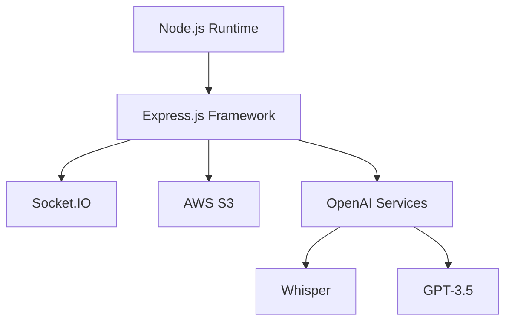
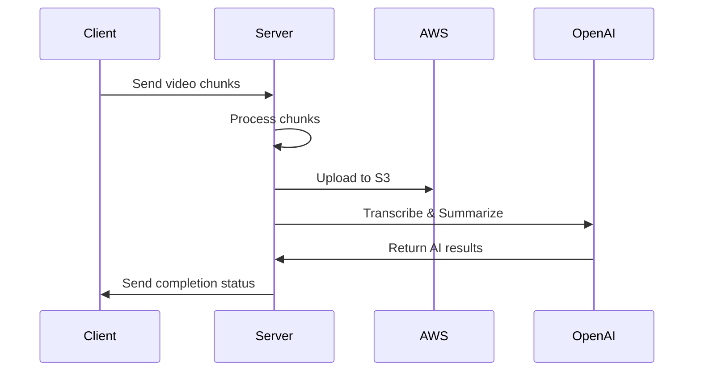

# 🎥 Reevo Recording Server

<div align="center">
  
  
  [](https://nodejs.org)
  [](LICENSE)
  [](CONTRIBUTING.md)
</div>

## 🌟 Overview

Reevo Recording Server is a high-performance Express.js application that powers the video processing and AI transcription capabilities of the Reevo screen recording platform. Built with scalability in mind, it seamlessly handles video uploads, cloud storage management, and intelligent content processing.

## ✨ Core Features

<div align="center">

| Feature                 | Description                                      |
| ----------------------- | ------------------------------------------------ |
| 🔄 Real-time Processing | Socket.IO-powered chunk handling                 |
| ☁️ Cloud Integration    | AWS S3 storage management                        |
| 🤖 AI Capabilities      | OpenAI Whisper transcription & GPT-3.5 summaries |
| 📈 Scalability          | Concurrent upload handling                       |
| 🔒 Security             | Robust file management & cleanup                 |

</div>

## 🛠️ Technology Stack

<div align="center">



</div>

## 🚀 Quick Start

### Prerequisites

- Node.js ≥ 18.0.0
- npm ≥ 9.0.0

### Environment Setup

Create a `.env` file:

```env
PORT=5000
AWS_BUCKET_REGION=your_bucket_region
AWS_ACCESS_KEY_ID=your_access_key
AWS_SECRET_ACCESS_KEY=your_secret_key
AWS_BUCKET_NAME=your_bucket_name
OPENAI_API_SECRET_KEY=your_openai_key
NEXT_API_HOST=your_api_host
ELECTRON_HOST=your_electron_host
```

### Installation

```bash
# Clone the repository
git clone https://github.com/abujobayer0/Reevo-Server-Express.git

# Navigate to project directory
cd Reevo-Server-Express

# Install dependencies
npm install

# Start the server
npm start
```

## 🔄 Processing Pipeline

<div align="center">



</div>

## 🌐 Ecosystem Integration

Reevo Recording Server is a specialized component that works directly with the desktop application while utilizing the Reevo web platform's API endpoints for database operations:

<div align="center">

| Component             | Repository                                                               | Connection Type                                   |
| --------------------- | ------------------------------------------------------------------------ | ------------------------------------------------- |
| 🖥️ Reevo Desktop App  | [Reevo Desktop](https://github.com/abujobayer0/Reevo-Desktop-ElectronJS) | WebSocket for direct video chunk transmission     |
| 🌐 Reevo Web Platform | [Reevo Web](https://github.com/abujobayer0/Reevo)                        | REST API endpoints for PostgreSQL database access |

</div>

### Connection Details

#### 🖥️ Desktop Application Connection

- Direct WebSocket connection for real-time video chunk processing
- Socket.IO-powered communication
- Status synchronization and progress tracking
- Secure communication on port 5000

#### 🌐 Web Platform Integration

- Utilizes Next.js web platform's API endpoints
- Shares PostgreSQL database with web platform
- No direct video streaming to web platform
- Authentication and data persistence through web platform's API

## 🛡️ Security Features

- CORS protection
- Environment variable security
- Secure file handling
- Automated cleanup processes

## 🤝 Contributing

We welcome contributions! Please see our [Contributing Guidelines](CONTRIBUTING.md) for details.

## 📄 License

This project is licensed under the MIT License - see the [LICENSE](LICENSE) file for details.

## 📞 Support & Contact

<div align="center">

[](mailto:zubayer.munna.dev@gmail.com)
[](https://github.com/abujobayer0/Reevo-Server-Express/issues)

</div>

---

<div align="center">
  
  Built with ❤️ by [Abu Jobayer](https://github.com/abujobayer0)
  
  [](https://github.com/abujobayer0)

</div>
